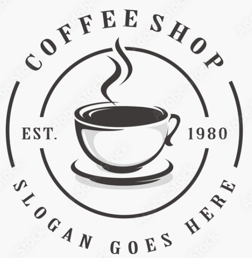

# Fresh Coffee - Site E-commerce de Café Premium ☕

<div align="center">
  
  
  [](https://developer.mozilla.org/en-US/docs/Web/HTML)
  [](https://developer.mozilla.org/en-US/docs/Web/CSS)
  [](https://developer.mozilla.org/en-US/docs/Web/JavaScript)
</div>

## 📋 Description

**Fresh Coffee** est un site web e-commerce moderne et responsive dédié à la vente de café premium. Ce projet présente une expérience utilisateur complète avec une interface élégante et intuitive pour découvrir et acheter des produits de café de qualité.

### 🌟 Caractéristiques Principales

- **Design Responsive** : Interface adaptée à tous les appareils (desktop, tablette, mobile)
- **Navigation Interactive** : Menu de navigation fluide avec animation
- **Panier d'Achat** : Système de panier fonctionnel pour la gestion des commandes
- **Recherche Produits** : Fonctionnalité de recherche intégrée
- **Galerie Produits** : Présentation attractive des différents cafés
- **Avis Clients** : Section dédiée aux témoignages et évaluations
- **Formulaire de Contact** : Interface de contact avec carte intégrée
- **Blog** : Section blog pour partager des actualités et conseils
- **Réseaux Sociaux** : Intégration des liens vers les plateformes sociales

## 🛠️ Technologies Utilisées

- **HTML5** : Structure sémantique et accessible
- **CSS3** : Styles modernes avec animations et transitions
- **JavaScript Vanilla** : Interactions dynamiques et fonctionnalités
- **Font Awesome** : Icônes vectorielles
- **Google Fonts** : Typographie personnalisée (Open Sans)
- **Google Maps** : Intégration de carte pour la localisation

## 🚀 Installation et Utilisation

### Prérequis
- Navigateur web moderne (Chrome, Firefox, Safari, Edge)
- Serveur web local (optionnel pour le développement)

### Installation

1. **Cloner le repository**
   ```bash
   git clone https://github.com/MouadHallaffou/mon_premier_projet_pour_coffe.git
   cd mon_premier_projet_pour_coffe
   ```

2. **Lancer le projet**
   - Ouvrir `index.html` directement dans un navigateur, ou
   - Utiliser un serveur local :
   ```bash
   # Avec Python
   python -m http.server 8000
   
   # Avec Node.js (http-server)
   npx http-server
   
   # Avec PHP
   php -S localhost:8000
   ```

3. **Accéder au site**
   - Naviguer vers `http://localhost:8000` (si serveur local)
   - Ou ouvrir directement le fichier `index.html`

## 📁 Structure du Projet

```
mon_premier_projet_pour_coffe/
│
├── index.html              # Page principale
├── style.css              # Feuille de styles
├── main.js                # Scripts JavaScript
├── README.md              # Documentation du projet
│
├── photo/                 # Images du site
│   ├── logo.png          # Logo du site
│   ├── 1.jpg - 8.jpg     # Images des produits et sections
│   ├── item-1.jpg - item-4.jpg  # Images des articles
│   └── pic-1.jpg - pic-4.jpg    # Photos des clients
│
└── icons/                 # Icônes et favicon
    └── react.ico         # Favicon du site
```

## 🎨 Fonctionnalités Détaillées

### Navigation
- Menu responsive avec animation burger pour mobile
- Navigation smooth scroll entre les sections
- Fermeture automatique des menus lors du scroll

### Panier d'Achat
- Ajout/suppression d'articles
- Affichage des prix
- Interface utilisateur intuitive

### Produits
- Galerie de produits avec hover effects
- Système d'évaluation par étoiles
- Prix avec réductions affichées

### Contact
- Formulaire de contact fonctionnel
- Carte Google Maps intégrée
- Informations de localisation

## 🎯 Sections du Site

1. **Accueil** : Présentation du concept avec call-to-action
2. **À Propos** : Histoire et valeurs de l'entreprise
3. **Menu** : Catalogue des cafés disponibles
4. **Produits** : Galerie détaillée avec options d'achat
5. **Avis** : Témoignages clients avec système d'étoiles
6. **Contact** : Formulaire et informations de contact
7. **Blog** : Articles et actualités sur le café

## 🎨 Personnalisation

### Couleurs Principales
```css
:root {
    --main-color: #d3821f;    /* Orange principal */
    --black: #13131a;         /* Noir foncé */
    --bg: #010103;           /* Arrière-plan */
    --border: .1rem solid rgba(255, 255, 255, .3);
}
```

### Responsive Design
- Breakpoints adaptés pour tous les appareils
- Images optimisées pour différentes résolutions
- Interface tactile friendly

## 👨‍💻 Auteur

**Mouad Hallaffou**
- 📧 Email : mouad@gmail.com
- 📍 Localisation : Maroc
- 🌐 Portfolio : [À venir]

## 🤝 Contribution

Les contributions sont les bienvenues ! Pour contribuer :

1. Fork le projet
2. Créer une branche pour votre fonctionnalité (`git checkout -b feature/AmazingFeature`)
3. Commit vos changements (`git commit -m 'Add some AmazingFeature'`)
4. Push vers la branche (`git push origin feature/AmazingFeature`)
5. Ouvrir une Pull Request

## 📝 License

Ce projet est sous licence libre. Vous êtes libres de l'utiliser, le modifier et le distribuer.

## 🔮 Améliorations Futures

- [ ] Intégration d'un système de paiement
- [ ] Base de données pour la gestion des produits
- [ ] Système d'authentification utilisateur
- [ ] Panel d'administration
- [ ] API REST pour les commandes
- [ ] Optimisation SEO avancée
- [ ] Tests automatisés

---

<div align="center">
  <p>Développé avec ❤️ par Mouad Hallaffou</p>
  <p>© 2024 Fresh Coffee. Tous droits réservés.</p>
</div>
